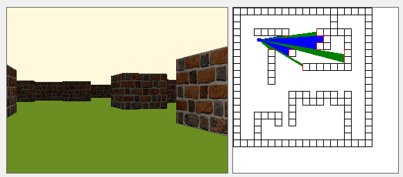

# Raycaster
### Project for "TDT4100 - Objektorientert programmering" at NTNU by Vetle Roos Mangrud

## Introduction
I have thought about making a raycaster since writing an article about game graphics in [readme](https://storage.googleapis.com/readme-arkiv.appspot.com/pdf/2020/2020-05.pdf#page=4).
The basic idea is to make a 3D-looing 2D projection of a 2D world (No 3D math involved :D)

Most of the code i wrote myself, but i drew a lot of inspiration and got most of the math stuff from [3DSage on YouTube](https://www.youtube.com/watch?v=gYRrGTC7GtA) and [Lode's Computer Graphics Tutorial](https://lodev.org/cgtutor/raycasting.html). I took small code-snippets from other places, but i have commented on that where relevant.

## Project requirements
- The app needs to have at least two interacting classes
    - It contains many (for example Game and Player)
- At least one of the classes needs to do some form of calculations
    - Calculation heavy classes are RayCaster and Vector
- All classes need encapsulation of its state, and validation where relevant
    - Teaching assistant agreed that validating every interaction between classes was unnecessary and a lot of work. Therefore I have focused on validating user input (Including modifying save files)
- The app needs to have a user interface made in FXML with Controller and App classes.
    - It has one App class and two scenes, GameUI.fxml and Launcher.fxml. Each scene has its own Controller class
- The app needs a system to save and load from a file.
    - The app reads save state and puts it in a cache when the game is started, and saves the cache to a file when the game is exited (Via the menu). There is also a system to load levels.
- There should be error handling where appropriate
    - Most of the errors come from invalid user input or problems with save data (user tampering and invalid save locations are example causes). Error handling is implemented to detect these errors and either abort an action (ex. save won't be created if user types an invalid save name. Broken save files are not shown), or perform a fix (ex. If player has no saved position, it will default to a starting location). This will stop the program from crashing
- The app has to be tested with JUnit tests
    - TA agreed that testing every part of the app (Especially the rendering) is a lot of work, and I got away with testing some classes. I have focused on testing the utility classes and storage.

## Usage
- Create a new save by writing a name and clicking the bytton.
- Click on a save to enter the game
- WASD keys to move (Can change in the Game-class)
- Escape key to open pause menu

